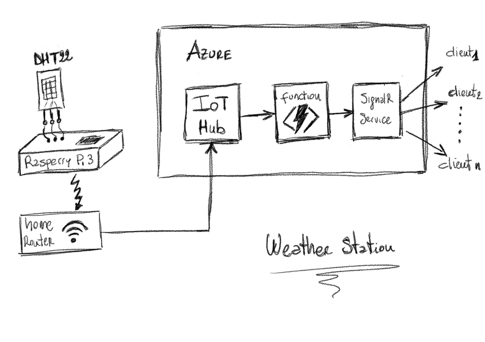

# Weather Station Proof of Concept
Welcome to the open-source [documentation](https://docs.microsoft.com/azure) of my proof of concept for implentation of a basic Weather Statio.

## Purpose
The goal of this poc is to experiment with a series of cloud technologies such as Azure IoT Hub, Azure Function and Azure SignalR.

### Azure IoT Hub
IoT Hub is a managed service, hosted in the cloud, that acts as a central message hub for bi-directional communication between your IoT application and the devices it manages. You can use Azure IoT Hub to build IoT solutions with reliable and secure communications between millions of IoT devices and a cloud-hosted solution backend. You can connect virtually any device to IoT Hub.

IoT Hub supports communications both from the device to the cloud and from the cloud to the device. IoT Hub supports multiple messaging patterns such as device-to-cloud telemetry, file upload from devices, and request-reply methods to control your devices from the cloud. IoT Hub monitoring helps you maintain the health of your solution by tracking events such as device creation, device failures, and device connections.

### Azure Function
Azure Functions is a serverless solution that allows you to write less code, maintain less infrastructure, and save on costs. Instead of worrying about deploying and maintaining servers, the cloud infrastructure provides all the up-to-date servers needed to keep your applications running.

### Azure SignalR
Azure SignalR Service simplifies the process of adding real-time web functionality to applications over HTTP. This real-time functionality allows the service to push content updates to connected clients, such as a single page web or mobile application. As a result, clients are updated without the need to poll the server, or submit new HTTP requests for updates.

## PoC High Level Architecture

### DHT-22 Sensor
The DHT22 (also named as AM2302) is a basic, low-cost digital temperature and humidity sensor. It uses a capacitive humidity sensor and a thermistor to measure the surrounding air, and spits out a digital signal on the data pin (no analog input pins needed). It uses a capacitive humidity sensor and a thermistor to measure the surrounding air. Temperature measuring range of the DHT22 is from -40°C to +125°C with ±0.5 degrees accuracy, and humidity measuring range, from 0% to 100% with accuracy from 2% to 5%.

The DHT-22 sensor is attached to a Raspeberry Pi 3 as shown on connection diagram below:

I bought the sensor on the following site [link](https://az-delivery.de).

### Raspberry Pi 3 (model B)
Raspberry Pi 3 Model B was released in February 2016 with a 1.2 GHz 64-bit quad core ARM Cortex-A53 processor, on-board 802.11n Wi-Fi, Bluetooth and USB boot capabilities.

In the followed picture my DHT-22 and Raspberry Pi:

I installed the **Raspberry Pi OS with desktop and recommended software** operating system  while keeping the basic configurations. Raspbian is a free operating system based on Debian optimized for the Raspberry Pi hardware.

[Raspberry Pi OS](https://www.raspberrypi.org/software/operating-systems/) official documentation 

### Adafruit_DHT Library

### ...
