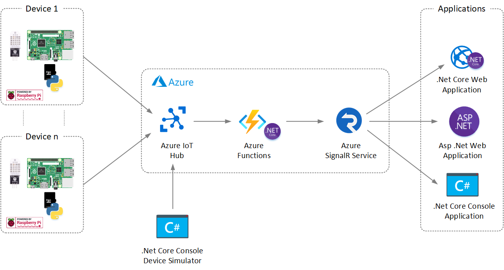
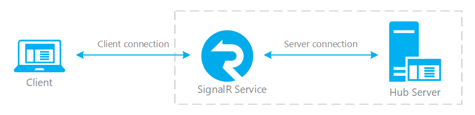
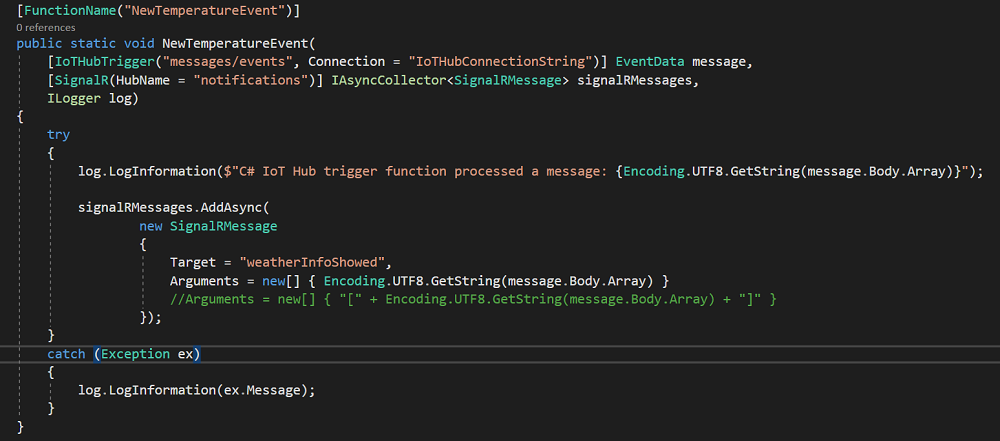

# Weather Station Proof of Concept
Welcome to the open-source of my proof of concept for implentation of a basic Weather Station.


## Purpose
The goal of this poc is to experiment with a series of cloud technologies such as **Azure IoT Hub**, **Azure Function** and **Azure SignalR**.


### Azure IoT Hub
IoT Hub is a managed service, hosted in the cloud, that acts as a central message hub for bi-directional communication between your IoT application and the devices it manages. You can use Azure IoT Hub to build IoT solutions with reliable and secure communications between millions of IoT devices and a cloud-hosted solution backend. You can connect virtually any device to IoT Hub.

IoT Hub supports communications both from the device to the cloud and from the cloud to the device. IoT Hub supports multiple messaging patterns such as device-to-cloud telemetry, file upload from devices, and request-reply methods to control your devices from the cloud. IoT Hub monitoring helps you maintain the health of your solution by tracking events such as device creation, device failures, and device connections.


### Azure Function
Azure Function is a serverless compute service that enables user to run event-triggered code without having to provision or manage infrastructure. Being as a trigger-based service, it runs a script or piece of code in response to a variety of events.

Azure Functions can be used to achieve decoupling, high throughput, reusability and shared. Being more reliable, it can also be used for the production environments.

Azure Functions is a serverless solution that allows you to write less code, maintain less infrastructure, and save on costs. Instead of worrying about deploying and maintaining servers, the cloud infrastructure provides all the up-to-date servers needed to keep your applications running.


### Azure SignalR
Azure SignalR Service simplifies the process of adding real-time web functionality to applications over HTTP. This real-time functionality allows the service to push content updates to connected clients, such as a single page web or mobile application. As a result, clients are updated without the need to poll the server, or submit new HTTP requests for updates.


## Weather Station PoC (Sketch)
Before starting the realization I defined which components should be the basis of the POC. To facilitate the decision I made a drawing of the final architecture:

In the followig figure, I am showing the sketch of Weather Station PoC.


## Solution Architecture
In the followig figure, the entire solution architecture of Weather Station PoC and the its main components are shown:



### Device
The main components on device side are:

#### Raspberry Pi 3 (model B)
The **Raspberry Pi 3** will be responsible for sending the temperature and humidity data retrieved from the sensor to the Azure IoT Hub service. The Integration between device and Azure IoT Hub will be done with a **IoT application** written in Python and with **Azure IoT Hub device SDK for Python** that will be described later.

For my PoC I reused an old Raspberry Pi 3 (model B) that I bought about a year ago. Raspberry Pi 3 Model B was released in February 2016 with a 1.2 GHz 64-bit quad core ARM Cortex-A53 processor, on-board 802.11n Wi-Fi, Bluetooth and USB boot capabilities.

I have also installed the **Raspberry Pi OS with desktop and recommended software** on Rasperry Pi 3. 

Raspberry Pi OS is a free operating system based on Debian optimized for the Raspberry Pi hardware. For further information this is the [link](https://www.raspberrypi.org/software/operating-systems/) where you can find the official documentation.

With Raspbian being the official OS for the Raspberry Pi,  I think that is a better choice for new users to start with due to it being so widely adopted and there are tons of examples and guidelines.


#### DHT-22 Sensor
The **DHT22 Sensor** will be responsible for retrieving the temperature and humidity data from environment. The Integration between Sensor and the Rasperry device will be done through a Python Library named **Adafruit_DHT Library**.  The details about Python Library will be discussed later.

The DHT22 (also named as AM2302) is a basic, low-cost digital temperature and humidity sensor. It uses a capacitive humidity sensor and a thermistor to measure the surrounding air, and spits out a digital signal on the data pin (no analog input pins needed). It uses a capacitive humidity sensor and a thermistor to measure the surrounding air. Temperature measuring range of the DHT22 is from -40°C to +125°C with ±0.5 degrees accuracy, and humidity measuring range, from 0% to 100% with accuracy from 2% to 5%.


I bought the sensor on the following site [link](https://az-delivery.de).

The DHT-22 sensor is attached to a Raspeberry Pi 3 as shown on connection diagram below:


#### Final Result
In the followed picture my DHT-22 and Raspberry Pi:


### Azure Services
In this section I will explain how to configure the Azure Services used for Weather Station PoC.

#### Azure IoT HUB
As previously mentioned azure Iot hub is a managed service, hosted in the cloud, that acts as a central message hub for bi-directional communication between your IoT application and the devices it manages. For my PoC the Azure IoT Hub will act as collector of events sent from Raspberry Pi 3 device. Only for PoC I will configure one 

Azure IoT Hub offers two tiers, **basic** and **standard**, that differ in the number of features they support. If your IoT solution is based around collecting data from devices and analyzing it centrally, then the basic tier is probably right for you. 

Azure IoT Hub also offers a **free tier** that is meant for testing and evaluation. It has all the capabilities of the standard tier, but limited messaging allowances. You cannot upgrade from the free tier to either basic or standard. For my PoC I chose the free tier option.

The free tier is intended for testing and evaluation. It allows **500 devices** to be connected to the hub and up to **8,000 messages per day**. Each Azure subscription can create one IoT hub in the free tier.

To provision a new **IoT Hub** I used the following command:

```
az iot hub create --name %iot_hub_name% --resource-group %resource_group_name% --sku F1 --partition-count 2 --location %location%
```

For more information on which tier is right for your solution this is an useful [link](https://docs.microsoft.com/en-us/azure/iot-hub/iot-hub-scaling?branch=release-iotbasic#basic-and-standard-tiers)

When Azure ioT Hub was provisioned, I need to create a device identity in the identity registry in my IoT hub (a device cannot connect to a hub unless it has an entry in the identity registry).


After the device is created, I need to retrieve and to secure the **Primary Connection String** that will use to configure the Python IoT application.

The IoT Hub identity registry only stores device identities to enable secure access to the IoT hub. It stores device IDs and keys to use as security credentials, and an enabled/disabled flag that you can use to disable access for an individual device. If your application needs to store other device-specific metadata, it should use an application-specific store. 

#### Azure SignalR
Azure SignalR Service simplifies the process of adding real-time web functionality to applications over HTTP. This real-time functionality allows the service to push content updates to connected clients, such as a single page web or mobile application. As a result, clients are updated without the need to poll the server, or submit new HTTP requests for updates. 

In my Weather Station PoC scenario, Azure SignalR will provide the real-time temperature and humidity data to two different type of client applications.

- .Net Core Web Sample Application
- .Net Code Console Sample Application

I'll keep the sample client application as simple as possible because in this PoC the main focus is the integration of all the components of the architecture shown above.

SignalR Service works with a broad range of clients, such as web and mobile browsers, desktop apps, mobile apps, server process, IoT devices, and game consoles. SignalR Service offers SDKs in different languages. In addition to native ASP.NET Core or ASP.NET C# SDKs, SignalR Service also provides JavaScript client SDK, to enable web clients, and many JavaScript frameworks. Java client SDK is also supported for Java applications, including Android native apps.

In the future, time permitting, it will be possible to extend the Weather Station PoC by adding other types of client applications (for example: Java, Python or .Net Framework).

Azure SignalR Service also offers a **free tier** that is meant for testing and evaluation:
- Concurrent Connections per Unit	20
- Messages / Unit / Day	20,000
- Max Units	1

**Note:** Changing SignalR Service from Free tier to Standard tier or vice versa, the public service IP will be changed and it usually takes 30-60 minutes to propagate the change to DNS servers across the entire internet. 

To provision a new **SignalR Service** I used the following command:

```
az signalr create -n %signalr% -g %resource_group_name% --service-mode Serverless --sku Free_F1
```
Service mode is an important concept in Azure SignalR Service. When you create a new SignalR resource, you will be asked to specify a service mode:

- **Default mode** requires hub server. When there is no server connection available for the hub, the client tries to connect to this hub fails. Default mode is the default value for service mode when you create a new SignalR resource. In this mode, your application works as a typical ASP.NET Core (or ASP.NET) SignalR application, where you have a web server that hosts a hub (called hub server hereinafter) and clients can have duplex real-time communication with the hub server. The only difference is instead of connecting client and server directly, client and server both connect to SignalR service and use the service as a proxy. Below is a diagram that illustrates the typical application structure in default mode



- **Serverless mode** does NOT allow any server connection, i.e. it will reject all server connections, all clients must in serverless mode. Serverless mode, as its name implies, is a mode that you cannot have any hub server. Comparing to default mode, in this mode client doesn't require hub server to get connected. All connections are connected to service in a "serverless" mode and service is responsible for maintaining client connections like handling client pings (in default mode this is handled by hub servers). Also there is no server connection in this mode (if you try to use service SDK to establish server connection, you will get an error). Therefore there is also no connection routing and server-client stickiness (as described in the default mode section). But you can still have server-side application to push messages to clients. This can be done in two ways, use REST APIs for one-time send, or through a websocket connection so that you can send multiple messages more efficiently (note this websocket connection is different than server connection).


- **Classic mode** is a mixed mode of default and serverless mode. In this mode, connection mode is decided by whether there is hub server connected when client connection is established. If there is hub server, client connection will be routed to a hub server. Otherwise it will enter a serverless mode where client to server message cannot be delivered to hub server. This will cause some discrepancies, for example if all hub servers are unavailable for a short time, all client connections created during that time will be in serverless mode and cannot send messages to hub server. ***Classic mode is mainly for backward compatibility for those applications created before there is default and serverless mode. It's strongly recommended to not use this mode anymore***.

**Note:** Since the azure signalr service must be integrated with an azure function it will be configured in **Serverless Mode**

SignalR Service is designed for large-scale real-time applications. SignalR Service allows multiple instances to work together to scale to millions of client connections. The service also supports multiple global regions for **sharding**, **high availability** or **disaster recovery** purposes.

Important information about perfomance as detailed [here](https://docs.microsoft.com/en-us/azure/iot-hub/iot-hub-scaling?branch=release-iotbasic#basic-and-standard-tiers)


#### Azure Function
In my Weather Station PoC, the Azure Function relay messages from Azure IoT Hub to Azure SignalR Service. Because **Azure SignalR Service** and **Azure Functions** are both fully managed, highly scalable services that allow you to focus on building applications instead of managing infrastructure, it's common to use the two services together to provide real-time communications in a serverless environment.

A serverless real-time application built with Azure Functions and Azure SignalR Service typically requires two Azure Functions:

- **negotiate function** that the client calls to obtain a valid SignalR Service access token and service endpoint URL


- **One or more functions** that handle messages from SignalR Service and send messages or manage group membership.



To relay messages from IoT Hub to Azure SignalR Service I configured **"NewTemperatureEvent" function** with the **IoTHubTrigger** (which can be used with IoT Hub's built-in Event Hubs compatible endpoint). When a message is received from IoT Hub, Azure Functions does all the work for us and will execute our code and use the SignalR output binding to send messages to clients connected to Azure SignalR Service. You can broadcast messages to all clients, or you can send them to a subset of clients that are authenticated with a specific user ID or have been added to a specific group. Azure SignalR is a managed real-time messaging service in Azure that does this really well. We can integrate it with Azure Functions using an output binding.

Azure Functions consumption plan is billed based on per-second resource consumption and executions. Consumption plan pricing includes a **monthly free** grant of **1 million requests** and **400,000 GB-s** of resource consumption per month per subscription in pay-as-you-go pricing across all function apps in that subscription. 

### Simulator
...

### Client Applications
...


# Develop the solution
This section will provide implementation details relating to the development of the main components of the PoC. We will start from the development of the IoT application on the Raspberry device.

## Device and Sensor test
I chose to use python for the development of the application on the device that will have to read the data from the sensor and send them to the Iot Hub. 

### Adafruit_DHT Library
As a starting point I used the **Adafruit_DHT** python library recommended by the sensor vendor. Before proceed, it we first need to make sure that Raspberry Pi OS is up to date and there are all software installed.

Before proceeding, we must first make sure that the Raspberry Pi operating system is up to date and that all software is installed. To do that, follow the steps below:

1. Start your Raspberry Pi, open terminal and run these commands:

2. First command is for making the system up to date:

```
sudo apt-get update && sudo apt-get upgrade -y
```

3. Second command is for installing python3-pip app. We will use pip app to install library:

```
sudo apt-get install python3-pip
```

4. Third command is for installing other apps that pip app uses during installation:

```
sudo python3 -m pip install --upgrade pip setuptools wheel
```

5. And after this is completed, we can install library that we need. Run thiscommand in terminal:

```
sudo pip3 install Adafruit_DHT
```

Before writing my first script to test the **Adafruit_DHT library**, I also installed my favorite editor [Visual Studio Code](https://code.visualstudio.com/).

6. Install Visual Studio Code

7. Open Visual Studio Code editor in Raspberry Pi OS, and copy-paste the following python script

```
import Adafruit_DHT
from time import sleep
sensor = Adafruit_DHT.DHT22

# DHT22 sensor connected to GPIO12.
pin = 12
print("[press ctrl+c to end the script]")
try: # Main program loop
   while True:
     humidity, temperature = Adafruit_DHT.read_retry(sensor, pin)

sleep(2.5)
if humidity is not None and temperature is not None:
    print("Temp={0:0.1f}*C Humidity={1:0.1f}%".format(temperature, humidity))
else:
    print("Failed to get reading. Try again!")

# Scavenging work after the end of the program
except KeyboardInterrupt:
    print("Script end!")
```

8. Save this script as **DHT22.py** and to run it, run this command in terminal:

```
python3 DHT22.py
```

And the output should look like this:


Now that we have tested our hardware, we can move on to analyze the architecture of the PoC


To be continued...
